# 神经网络剪枝综述

###  **摘要** 

------

&emsp;&emsp;近年来，剪枝已经成为优化神经网络模型最主要的方法之一，其目的是减少神经网络模型中的冗余参数，提高模型运算速度。通常，模型剪枝共包含三个步骤，即首先训练一个过参数模型，然后对模型进行剪枝，最后对剪枝后的模型进行微调，如此循环往复得到优化后的神经网络模型。由此可以看出，剪枝算法过于繁杂。此外， [Liu](https://arxiv.org/pdf/1810.05270) 等人通过实验证明了，使用大多数剪枝方法得到的模型反而没有以相同结构训练得到的模型效果更好。因此，本文在  [Liu](https://arxiv.org/pdf/1810.05270) 等人的基础上，总结了近年来的模型剪枝方法及其他更有效的卷积神经网络架构。

### **引言** 

------

&emsp;&emsp;训练过参数化的深度神经网络模型已经是一种提高网络效果的公认的方法了（[Denton et al., 2014](https://arxiv.org/abs/1404.0736); [Ba & Caruana, 2014](https://arxiv.org/abs/1312.6184)），然而这将导致过高的及计算成本和过高的内存占用。为了弥补这种损失，神经网络剪枝可以有效的减少网络计算成本，提高网络运算效率；另一种方法则是设计轻量型架构从头训练以达到相同的目的。***因此，这便引出了另一个问题，究竟是基于过参数化网络的剪枝算法更有效，还是只是直接设计轻量化模型从头更有效。***

&emsp;&emsp;对于剪枝算法通常包括三步：1）训练一个大的过参数化模型，2）根据某个剪枝算法修剪训练好的模型，3）微调修剪后的模型，以恢复损失的性能，如下图所示。

    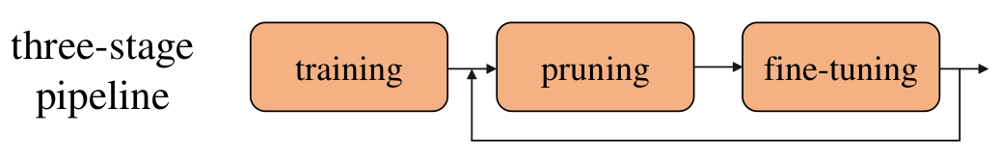
     
    
图 1：典型的三步网络剪枝步骤

&emsp;&emsp;一般来说，研究者们认为训练一个大的过参数化模型很重要，因为这样会提高模型的表征和优化能力，因此也可以安全地删除冗余参数而不会对准确率造成显著损失。并且剪枝后的网络架构和权重参数被认为是获取最终高效模型的关键，所以大多数现有剪枝算法选择微调剪枝后的模型而不是从头训练。***由此可以得出，选择哪些参数进行剪枝是这类算法的关键所在，目前各类剪枝算法也是围绕这一问题展开研究及实验。***

&emsp;&emsp;本文主要讨论 [Liu](https://arxiv.org/pdf/1810.05270) 等人所提出的观点，即是否有必要对基于过参数化的神经网络模型进行剪枝，而不是直接通过轻量型的架构从头训练。

### 相关算法及实验结果

------

#### 1. [L1-norm based channel pruning](https://arxiv.org/abs/1608.08710)

&emsp;&emsp;基于 L1-norm 剪枝的方法是最早用于卷积神经网络通道剪枝的方法之一：

    

&emsp;&emsp;普遍认为，在卷积层中，某个卷积核权重的绝对值越小，则其作用也就越小。因此，在每一层卷积层中，将剪掉一定比例的 L1-norm 值较小的卷积核，其对结果的影响就越小。[Liu](https://arxiv.org/pdf/1810.05270) 等人基于 VGG 和 ResNet ，分别在 CIFAR-10 和 ImageNet 数据集上，进行了剪枝预训练网络与剪枝后相同架构的轻量型网络从头训练的对比实验，结果如下：

    
表 1：基于 L1-norm 的剪枝算法与从头训练的网络架构对比实验

     
    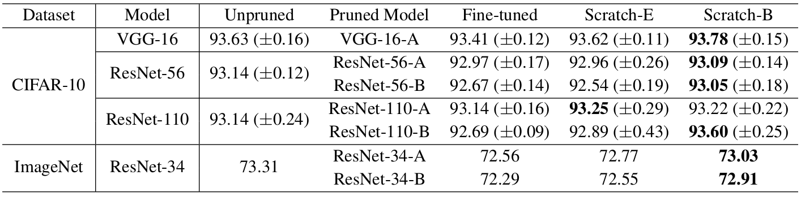

&emsp;&emsp;其中 Unpruned 表示与预训练网络 Baseline，Fine-turned 表示采用 L1-norm 剪枝算法微调的结果，Scratch-E 表示与 Baseline 训练相同 Epoch 的轻量型网络，Scratch-B 表示与 Baseline 训练相同计算量的轻量型网络，例如若 Bseline 训练 m 个 Epoch ，通过 L1-norm 剪枝减少了 50% 的计算量，则 Scratch-B 训练批次为 2m 个 Epoch。

&emsp;&emsp;***从实验结果可以看出，基于 L1-norm 剪枝后相同架构的轻量型网络从头训练的结果总是优于使用 L1-norm 剪枝后的结果，甚至优于 Baseline。***

#### 2. [ThiNet](https://arxiv.org/abs/1707.06342)

&emsp;&emsp;在 ThiNet 算法中，剪枝的标准是通过下一层的统计信息来指导当前层的剪枝，其算法框架如下图所示：

    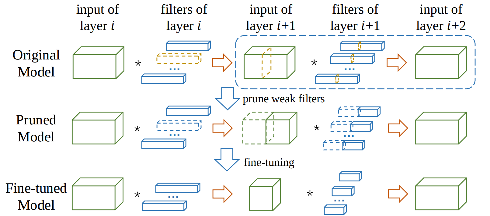
     
    
图 2：ThiNet 算法剪枝流程

&emsp;&emsp;首先，通过途中虚线部分判断哪些通道及其对应的卷积核作用较弱；这些通道及其对应的卷积核对网络性能影响较小，因此可以被丢弃，从而到底一个剪枝的模型；最后通过微调来回复损失的性能。

&emsp;&emsp;具体来说，一般带偏置的卷积计算如下：

    

&emsp;&emsp;若定义：

    

&emsp;&emsp;则卷积公式可以简化为：，其中。若找到一个通道的子集使得成立，那么就可以将任何的通道在不损失模型精度的情况下删除。显然，并不能保证所有的与总保持成立，因此可以选择一部分样本来计算一个使得公式成立的子集。

&emsp;&emsp;ThiNet 使用一种通道选择的贪心算法来得到上述子集，给定 m 个训练样本，则通道选择问题可转化为以下优化问题：

    

&emsp;&emsp;其中 r 为压缩比率，即保留通道个数，若令 T 为删除的通道集合，且，则上式可优化为：

    

&emsp;&emsp; ThiNet 采用一种贪心算法求解 S：

    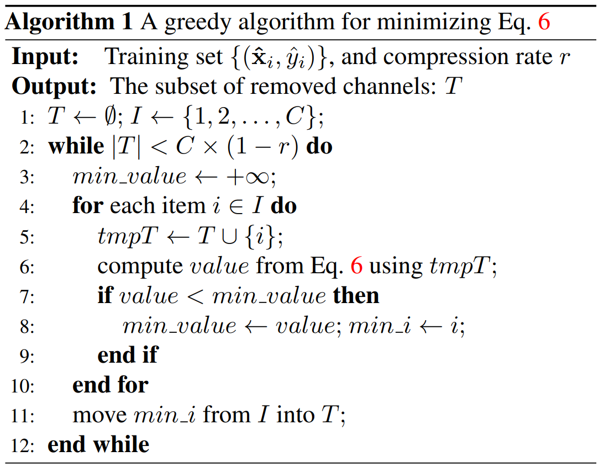

&emsp;&emsp;剪枝后的网络与从头训练的轻量型网络对比试验如下：

    
表 2：基于 ThiNet 的剪枝算法与从头训练的网络架构对比实验

     
    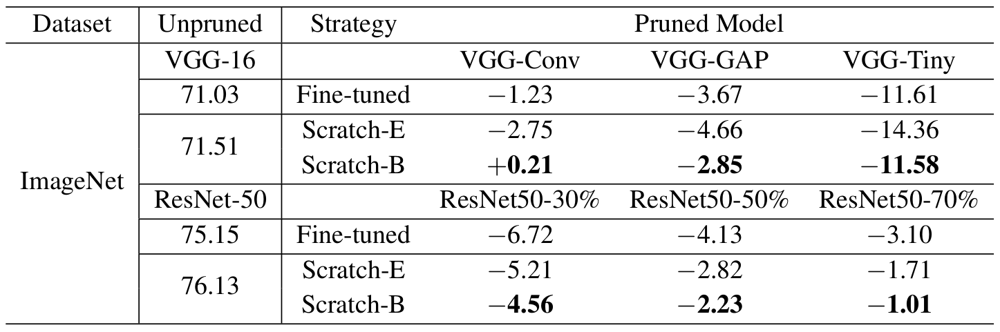

&emsp;&emsp;从结果可以看出从头训练的轻量型网络总能训练到与剪枝厚度模型相同的性能，甚至更优。

#### 3. [Regression based feature reconstruction](https://arxiv.org/abs/1707.06168)

    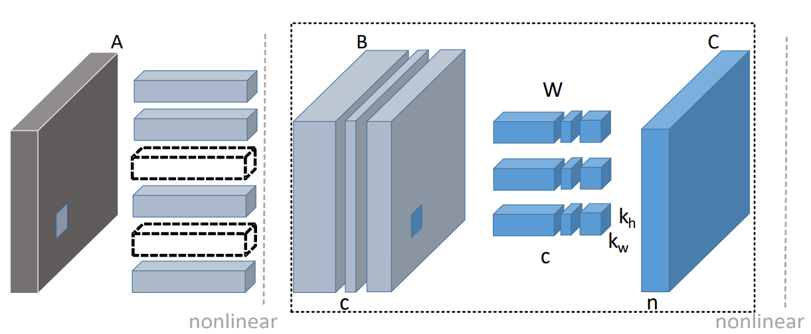
     
    
图 3：Channel Pruning 算法剪枝流程

&emsp;&emsp;Channel Pruning 算法共分为两步操作进行：第一步是通道选择，这一步采用 LASSO 回归，即添加一个 L1  范数来约束权重，因为 L1 范数可以使得权重中大部分值为 0 ，所以能使权重更加稀疏，这样就可以把那些稀疏的通道剪掉；第二步是特征重建，这一步是基于最小二乘来约束剪枝后输出的特征图要尽可能和减枝前的输出特征图相等，也就是最小二乘值越小越好。根据 [Chen](http://101.132.144.25/nullmax-dev/machine-learning/network-optimization/tree/survey) 之前的工作可以知道，Channel Pruning 算法并不能在带有 Res-block 的网络中有很好的表现，因此，这也是此方法最大的缺点。其对比试验如下所示：

    
表 3：基于 Channel Pruning 的剪枝算法与从头训练的网络架构对比实验

     
    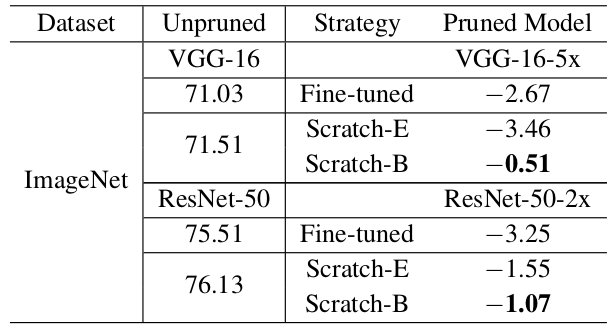

&emsp;&emsp;就结果而言，从头训练的轻量型模型总是优于剪枝微调后的模型。

#### 4. [Networking Slimming](https://arxiv.org/abs/1708.06519)

    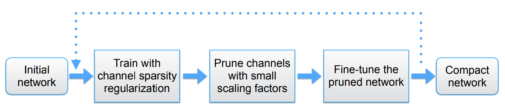
     
    
图 4：Networking Slimming 算法剪枝流程

&emsp;&emsp;Networking Slimming 算法利用卷积神经网络中 Batch-norm 层中的 gamma 参数最为选择通道的依据进行模型剪枝，作者认为，gamma 值越小，其所对应的通道及越不重要，因此可以进行剪枝。此外，通过在目标函数中加入一个关于 gamma 的 L1 正则项作为其约束：

    

&emsp;&emsp;接着将该网络中的所有 gamma 进行排序，根据人为给出的剪枝比例，去掉那些  gamma 很小的通道，也就是对应的卷积核。最后进行微调。反复多次进行这个过程，得到最终的微调模型，如图 4 所示。对于类似 ResNet 或 DenseNet 这类存在 shorcut 连接的网络，Networking Slimming 会统一对该特征图的输出进行处理，只选择没有被剪掉的通道，这一点要优于上述 Regression 方法，[Chen](http://101.132.144.25/nullmax-dev/machine-learning/network-optimization/tree/survey) 之前也进行了相关实验。其与从头训练的模型的对比实验如下所示：

    
表 4：基于 Networking Slimming 的剪枝算法与从头训练的网络架构对比实验

     
    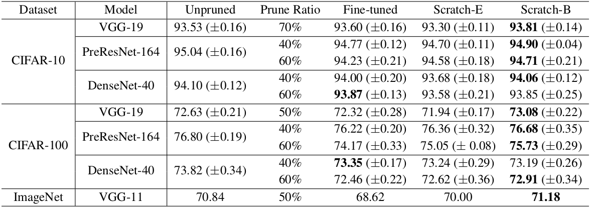

&emsp;&emsp;实验结果仍表示，从头训练模型可以达到剪枝后模型的效果，大部分要优于剪枝结果。由此，[Liu](https://arxiv.org/pdf/1810.05270) 等人得出了以下结论：

&emsp;&emsp; 1.  训练一个过参数化的模型对最终得到一个有效的小模型不是必要的；

&emsp;&emsp; 2.  为了得到剪枝后的小模型，求取预训练模型中重要的参数并不关键；

&emsp;&emsp; 3.  剪枝得到的结构，相比求得的权重更重要。因此可以将剪枝算法看做是网络结构搜索的一种特例。

#### 5. [AutoPruner](https://arxiv.org/pdf/1805.08941.pdf)

&emsp;&emsp;AutoPruner 算法可以认为是 ThiNet 改进之后的方法，但是其核心方法大不相同，这篇文章也是对 [Liu](https://arxiv.org/pdf/1810.05270) 提出的结论较为质疑的。其剪枝流程不同与典型的三步剪枝流程（图 1），其流程如下所示：

    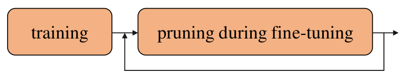
     
    
图 5：AutoPruner 算法两步剪枝流程

&emsp;&emsp;具体框架如下图所示，在第 i 个卷积层输出增加一个分支，输入为其输出特征图，依次经过 Batch-wise Pooling -> FC -> scaled sigmoid 的变换，将输出范围控制在 [0，1]，然后与输出特征图逐元素相乘，剪掉相应的通道。通过学习 FC 层的参数，就可以得到适当的 mask，判断该剪掉第 i 个卷积层的哪个卷积核。其中，scaled sigmoid 变换是指 。通过训练过程中不断增大 ，就可以控制 sigmoid 的取值，最终实现 0−1 门的效果。

    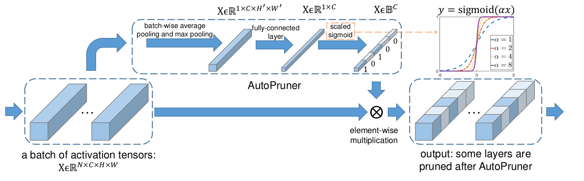
     
    
图 6：AutoPruner 算法流程

&emsp;&emsp;然后，构造损失函数：

    

&emsp;&emsp;其中， 是 sigmoid 输出的 mask， C 是输出通道数，r 是目标稀疏度。此外，FC 层初始化也有所不同，详细见 [AutoPruner](https://arxiv.org/pdf/1805.08941.pdf) 。其实验结果如下表所示，其中 ThiNet-50 从头训练的 Baseline 是 73.90％，这个结果远高于大多数现有剪枝算法，但仍低于 AutoPruner 算法（74.76％）。

    
表 5：AutoPruner 实验结果

     
    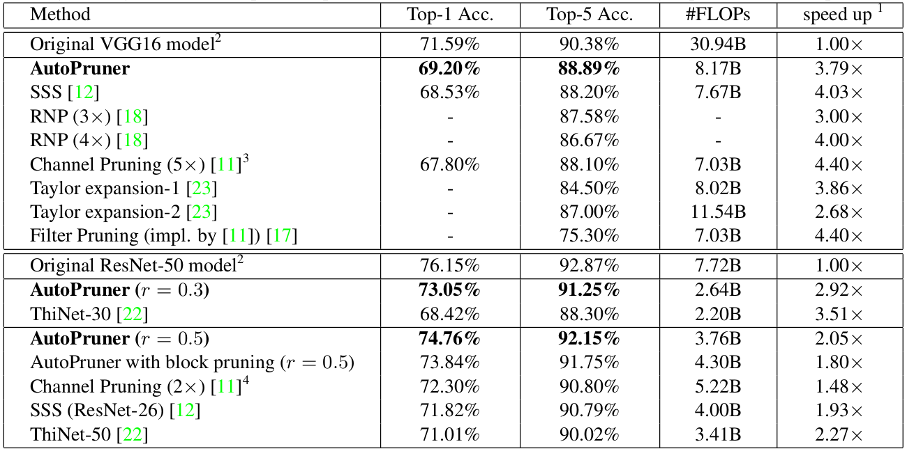

### 总结

------

&emsp;&emsp;由 [Liu](https://arxiv.org/pdf/1810.05270) 等人的工作可以看出，目前大多数最好的结构化剪枝算法的表现都不如从头训练的网络表现更好，然而 [AutoPruner](https://arxiv.org/pdf/1805.08941.pdf) 的实验中却得到了相反的结论，但是本文认为  [AutoPruner](https://arxiv.org/pdf/1805.08941.pdf) 并没有进行公平的实验来比较两者的优劣，其主要是因为文章中提到的是 ThiNet-50 的 Baseline 与 [AutoPruner](https://arxiv.org/pdf/1805.08941.pdf) 的比较，并没有使用 AutoPruner 剪枝后的模型从头训练做比较，因此其结论还有待商议。但是，这并不是说剪枝算法没有价值，我们在构建模型时，并不知道到底什么参数规模的网络可以没有冗余的学习到更多的信息，因此我们可以参照 [Liu](https://arxiv.org/pdf/1810.05270) 等人的结论：剪枝算法看做是网络结构搜索的一种特例。即可以参照剪枝后的架构来搭建更高效的网络架构。
