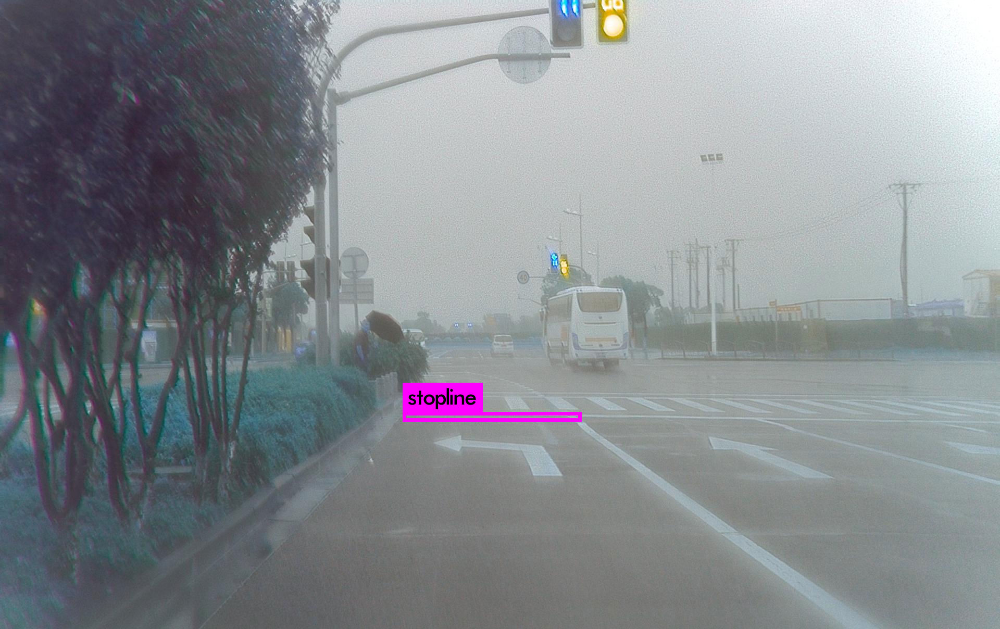

## 训练环境

基于 [g-darknet](https://github.com/generalized-iou/g-darknet) 框架，硬件平台 GTX1080 8G 。

## 配置参数

实验在 Stopline 数据集下，分别在 MSE loss 、GIoU loss 和 IoU loss 上训练770个epoch， Batch size = 128，Learning rate = 0.001，Normalizer (iou: 0.750000, cls: 1.000000)，使用 SGD 优化器。

## 训练结果

下图是MSE  、GIoU  和 IoU 的训练loss曲线图

## 评估结果

测试数据为 Stopline 测试集 200 个样本，模型评估结果如下表所示：

<table>
        <tr>
            <th></th>
            <th>MSE Loss/mAP</th>
            <th>GIoU Loss/mAP</th>
            <th>IoU Loss/mAP</th>
        </tr>
        <tr>
            <th>IoU=0.50</th>
            <th>0.499</th>
            <th>0.668</th>
            <th>0.671</th>
        </tr>
    	<tr>
            <th>IoU=0.55</th>
            <th>0.438</th>
            <th>0.638</th>
            <th>0.592</th>
        </tr>
        <tr>
            <th>IoU=0.60</th>
            <th>0.335</th>
            <th>0.538</th>
            <th>0.483</th>
        </tr>
        <tr>
            <th>IoU=0.65</th>
            <th>0.200</th>
            <th>0.471</th>
            <th>0.375</th>
        </tr>
        <tr>
            <th>IoU=0.70</th>
            <th>0.124</th>
            <th>0.304</th>
            <th>0.254</th>
        </tr>
        <tr>
            <th>IoU=0.75</th>
            <th>0.055</th>
            <th>0.178</th>
            <th>0.117</th>
        </tr>
        <tr>
            <th>IoU=0.80</th>
            <th>0.029</th>
            <th>0.105</th>
            <th>0.062</th>
        </tr>
        <tr>
            <th>IoU=0.85</th>
            <th>0.017</th>
            <th>0.069</th>
            <th>0.030</th>
        </tr>
        <tr>
            <th>IoU=0.90</th>
            <th>0.011</th>
            <th>0.030</th>
            <th>0.005</th>
        </tr>
        <tr>
            <th>IoU=0.95</th>
            <th>0.000</th>
            <th>0.005</th>
            <th>0.000</th>
        </tr>
        <tr>
            <th>GIoU=0.50</th>
            <th>0.469</th>
            <th>0.664</th>
            <th>0.658</th>
        </tr>
        <tr>
            <th>GIoU=0.55</th>
            <th>0.358</th>
            <th>0.581</th>
            <th>0.575</th>
        </tr>
        <tr>
            <th>GIoU=0.60</th>
            <th>0.275</th>
            <th>0.512</th>
            <th>0.455</th>
        </tr>
        <tr>
            <th>GIoU=0.65</th>
            <th>0.162</th>
            <th>0.463</th>
            <th>0.343</th>
        </tr>
        <tr>
            <th>GIoU=0.70</th>
            <th>0.120</th>
            <th>0.291</th>
            <th>0.236</th>
        </tr>
        <tr>
            <th>GIoU=0.75</th>
            <th>0.048</th>
            <th>0.175</th>
            <th>0.108</th>
        </tr>
        <tr>
            <th>GIoU=0.80</th>
            <th>0.029</th>
            <th>0.105</th>
            <th>0.062</th>
        </tr>
        <tr>
            <th>GIoU=0.85</th>
            <th>0.017</th>
            <th>0.066</th>
            <th>0.030</th>
        </tr>
        <tr>
            <th>GIoU=0.90</th>
            <th>0.011</th>
            <th>0.030</th>
            <th>0.005</th>
        </tr>
   		<tr>
            <th>GIoU=0.95</th>
            <th>0.000</th>
            <th>0.005</th>
            <th>0.000</th>
        </tr>
</table>

### 实验结果分析

GIoU Loss 和 IoU Loss 相比于MSE Loss对模型有比较大的提升，其中使用GIoU Loss 和 IoU Loss 训练 YOLOv3 都有很高的提升。

当评价指标为 IoU ，IoU_thr > 0.50时，使用GIoU Loss 的 YOLOv3 mAP 高于使用其他两种 Loss 函数训练的YOLOv3，IoU_thr = 0.50 时使用 IoU Loss 训练的 YOLOv3 的mAP高于使用其他两种 Loss 函数的训练结果；

当评价指标为 GIoU ，使用 GIoU Loss 训练的模型的 mAP 都优于其他两种 Loss 。

## 检测结果演示

其检测效果优于 PyTorch 版本的YOLOv3

