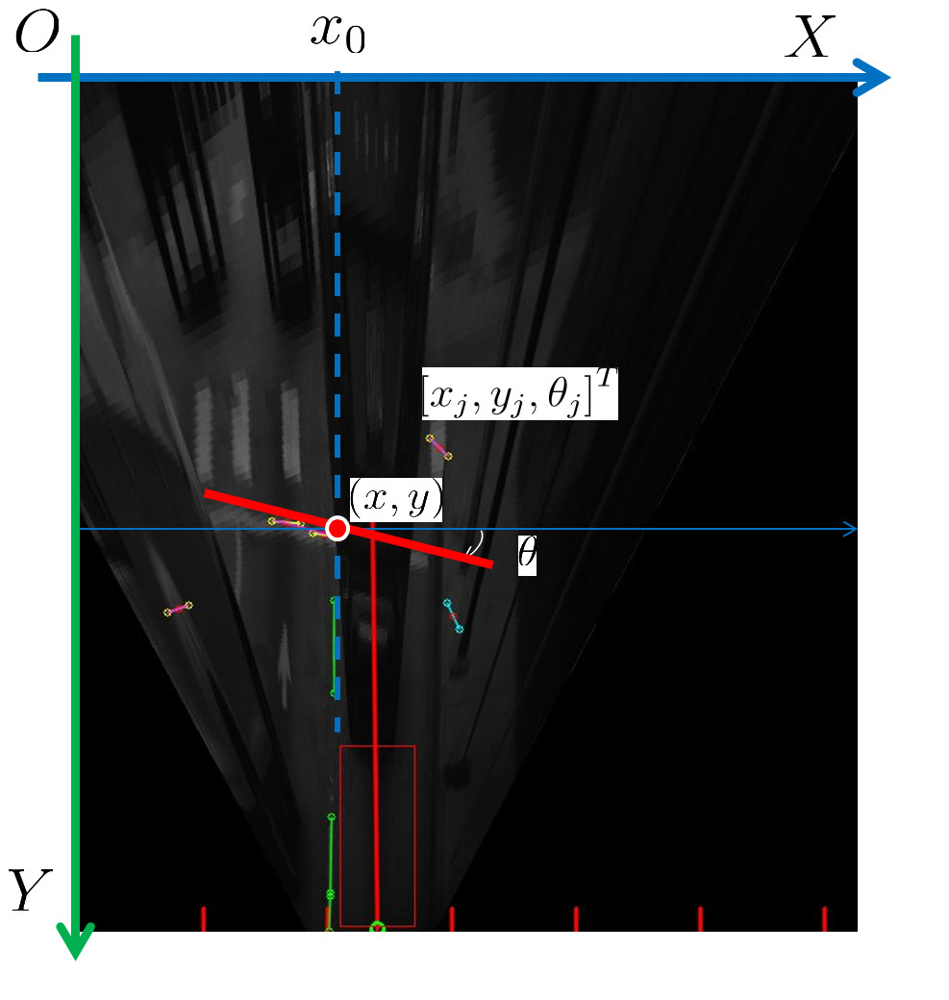

# Simple On-line and Real-time Tracking (SORT)

&emsp;&emsp;实验采用 SORT 多目标跟踪算法对 Stop-line 进行 on-line tracking。

###  ***1. 简介***

&emsp;&emsp;SORT算法是以目标检测算法输出的 bbox 为基础，通过 Linear Kalman Filter 和 Hungary Algorithm 实现对目标的跟踪。其中 Kalman Filter 负责估计目标的运动信息。若没有检测框信息，即目标检测算法没有检测出目标，则使用线性模型进行位置预测；Hungary Algorithm 负责计算目标当前帧与上一帧的关联性，以此来管理追踪目标的生命周期。

### ***2. 方法***

***检测阶段***

&emsp;&emsp;采用 ***YOLOv3*** 检测模型对 Stop-line 进行检测， 输出目标的 ；

***跟踪阶段*** 

&emsp;&emsp;将 Stop-line 帧间运动近似为简单的线性运动通过 Kalman Filter 对下一帧的 bbox 位置进行预测，状态向量定义如下:

    

&emsp;&emsp;观测向量为:

    

&emsp;&emsp;状态预测方程为：

    
      
    

&emsp;&emsp;其中状态转移矩阵 F 为：

    

&emsp;&emsp;状态更新方程如下：

       
       
    

&emsp;&emsp;噪声矩阵和 H 如下：

	  
	  
    

&emsp;&emsp;初始化状态：

		

&emsp;&emsp;使用 Hungary Algorithm 进行数据关联，使用的cost矩阵是原有目标在当前帧中的预测位置和当前帧目标检测框之间的 IoU，当小于指定 IoU 阈值结果是无效的。

***追踪目标的出现和消失***

&emsp;&emsp;检测到某个目标和所有已有目标预测结果的 bbox​ 的 IoU 都小于指定阈值时，则认为出现了新的待追踪目标，使用 ​bbox​ 初始化新目标的位置，速度设置为 0。新的追踪目标会经历一段待定时间去和检测结果进行关联以累计出现新目标的置信度，从而防止目标检测的虚警造成的新追踪目标误创建。 

&emsp;&emsp;在实验中，由于远处的 Stop-line 的 bbox​ 非常小，会使下一帧中同一目标的 IoU 值为 0 从而似的算法判定为是新的目标而失去跟踪，因此采用了可以更好的衡量距离的 GIoU 为判定数据关联的标准。

&emsp;&emsp;如果连续   帧没有实现已追踪目标预测位置和检测框的 GIoU 匹配，则认为目标消失。实验中设置，原因有二，一是匀速运动假设不合理，二是作者主要关注短时目标追踪。另外，尽早删除已丢失的目标有助于提升追踪效率。

# A Vision System for Detection and Tracking of Stop-Lines
### ***1. 简介***

&emsp;&emsp;文章首先通过空间滤波器进行横竖线检测，根据横竖线检测的结果以及消失点（Vanishing point）定义感兴趣区域（Region of Interest， ROI）；然后，将 ROI 通过 IPM（Inverse Perspective Mapping）变换将 ROI 转换到地面视角（俯视）；其次，利用横线检测和分组，计算不同横线是 Stop-line 的概率从而检测出 Stop-line；最后，通过 无损卡尔曼滤波器（Unscented Kalman Filter， UFK）对检测出的 Stop-line 跟踪。

		

### ***2. 方法***
***UKF***

&emsp;&emsp;系统通过  描述停止线在平面中的位置姿态，状态向量定义如下：

	

&emsp;&emsp;观测向量如下：

	

&emsp;&emsp;状态预测方程如下：

      
      
    

&emsp;&emsp;此外，系统还定义了观测值的预测方程：

	

&emsp;&emsp;由于系统的观测预测方程为非线性方程  ，因此需要对  进行无损变换，共三个步骤：

1. **Generate  Points:**

&emsp;&emsp;根据随机向量  的统计量  和  ，构造  点集：

	

&emsp;&emsp; 为尺度参数，可以调整其以提高逼近精度，利用这组采样点  来近似表示状态  的高斯分布；

2. **Predict  Points：**

&emsp;&emsp;对所有构造的点集进行  非线性转换，得到变换后的  点集：

	

&emsp;&emsp;变换后的点集  即可近似表示  的分布；

3. **Predict Mean and Covariance:**

&emsp;&emsp;对变换后的点集进行加权处理，从而得到  的均值和方差：

   

   	  
   
   
 

&emsp;&emsp; 和  分别是计算  的均值和方差所用的加权：

 

          
       
        

 

&emsp;&emsp;其中  ，在均值和方差加权中需要确定  、 和  三个参数，其取值范围分别为：

   

          
          
        
   

&emsp;&emsp;其中  和  影响估计的均值， 影响方差。

&emsp;&emsp;将变换后的结果带入方程，后续步骤与  Kalman Filter 相同，初始化状态为:
        

      
      
      
    

&emsp;&emsp;更新方程如下：

      
      
      
    

