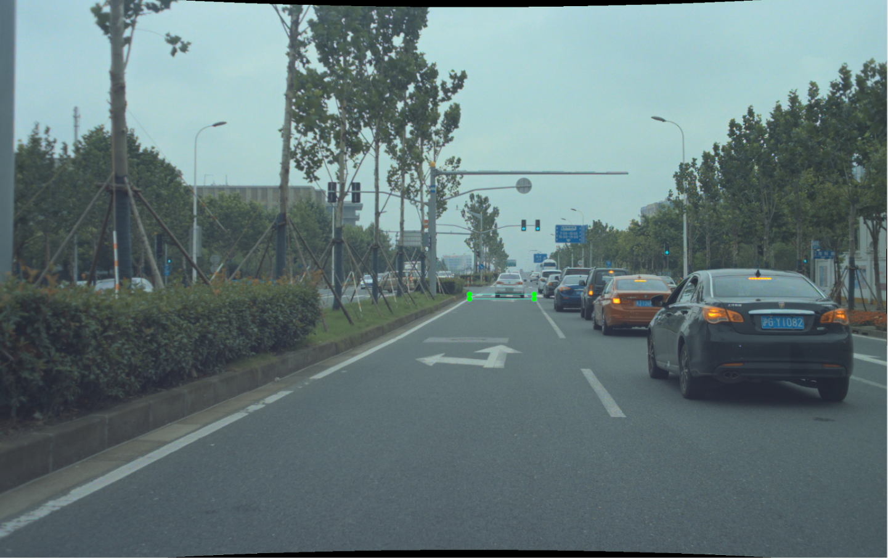
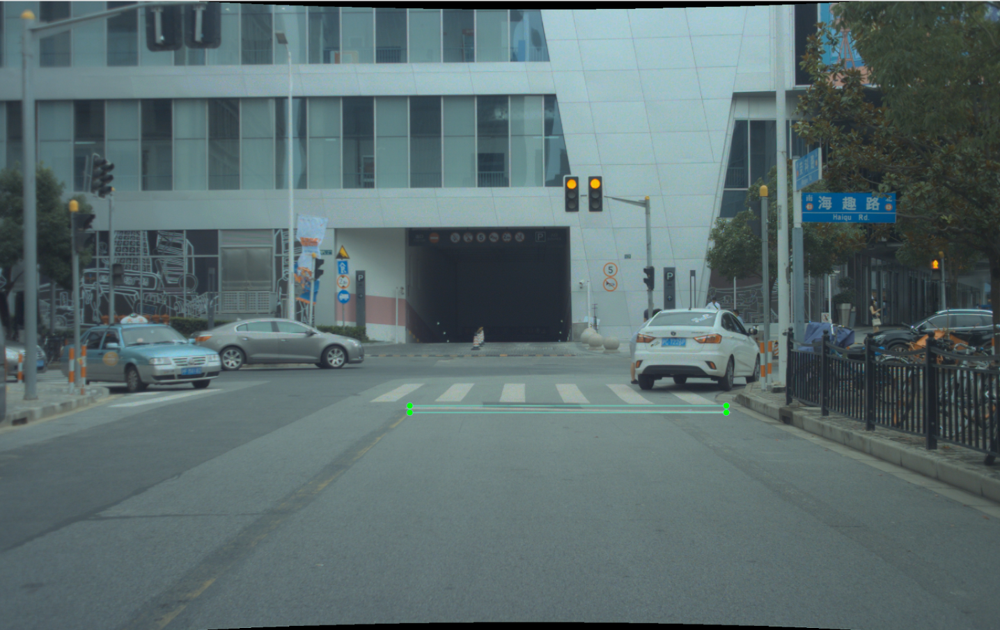
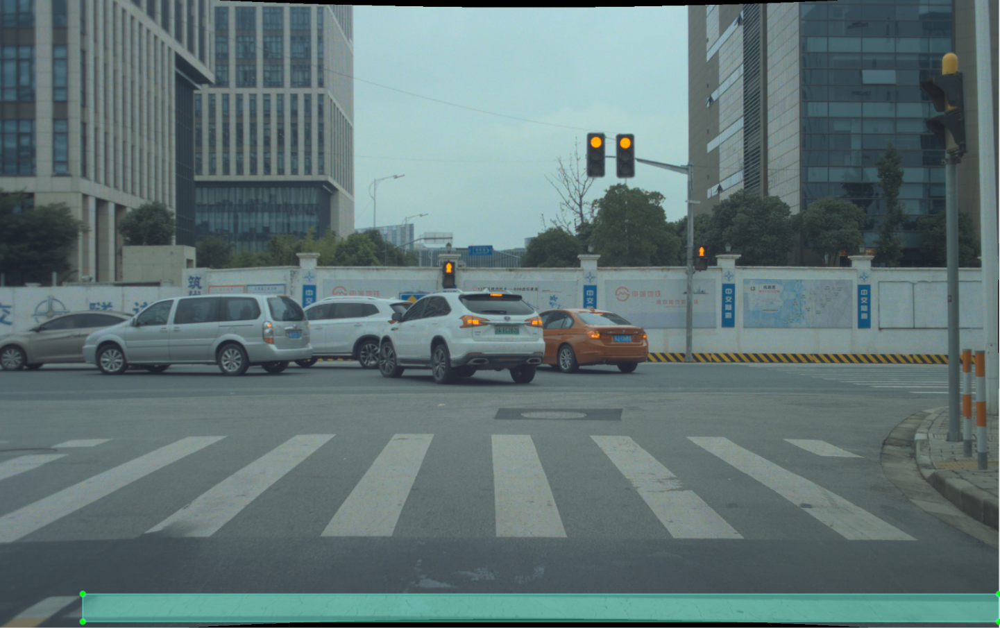
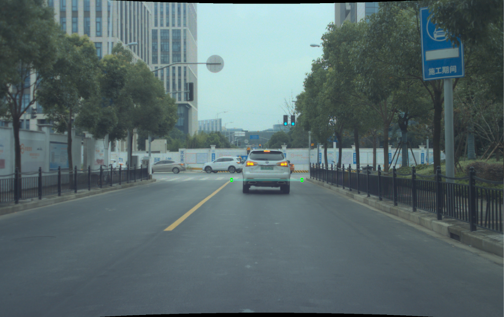
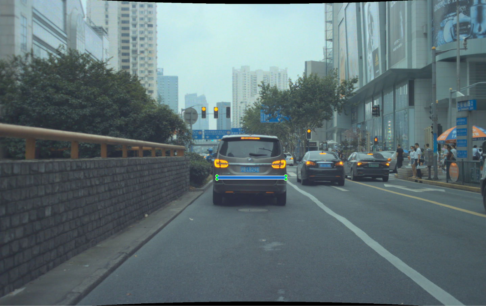
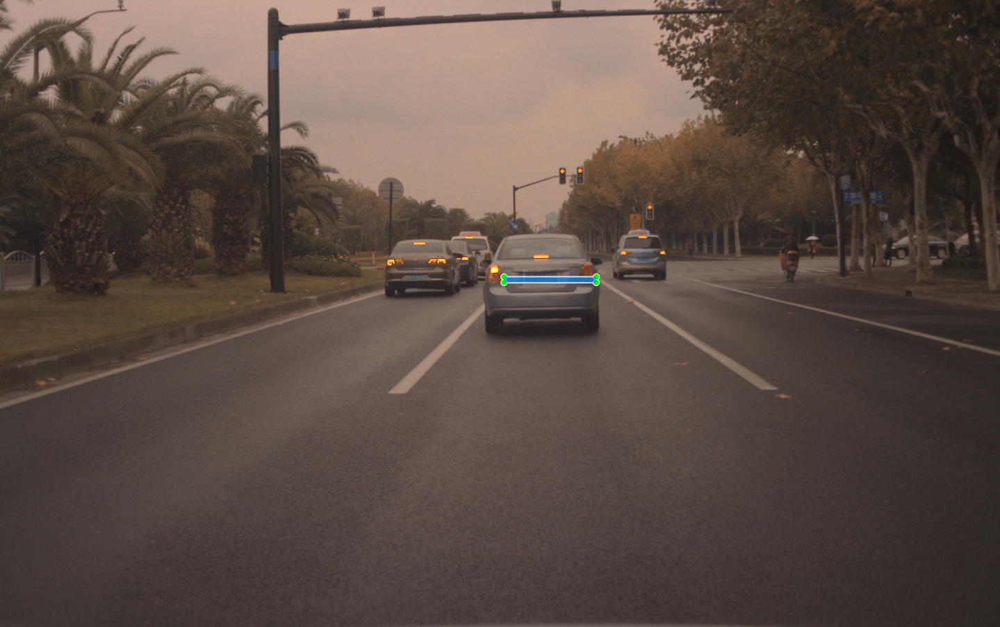
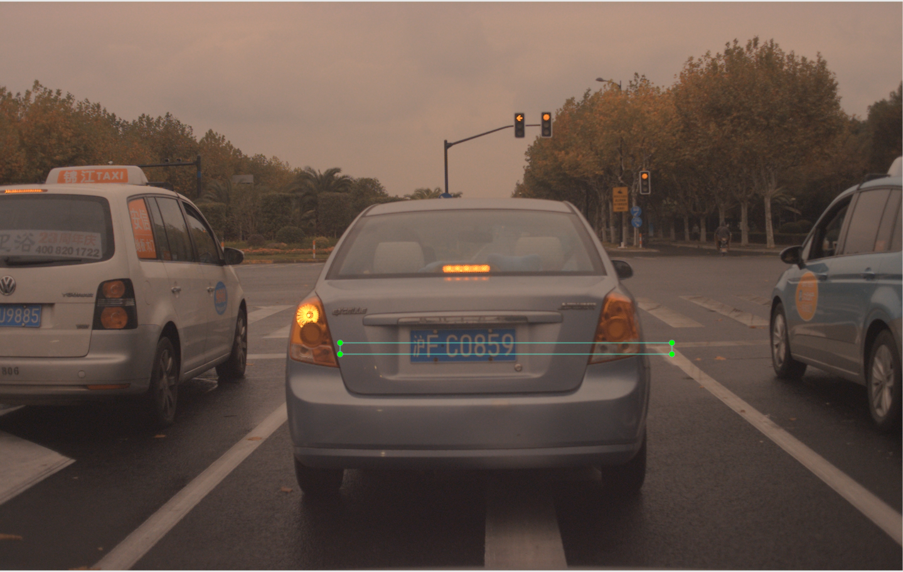
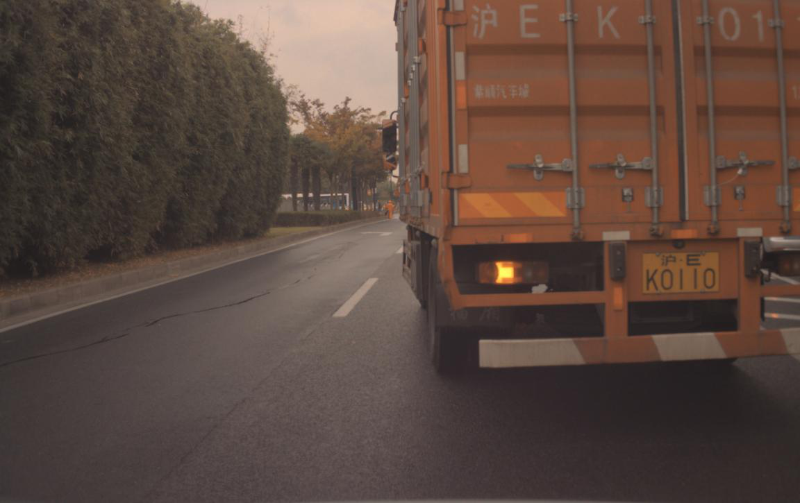
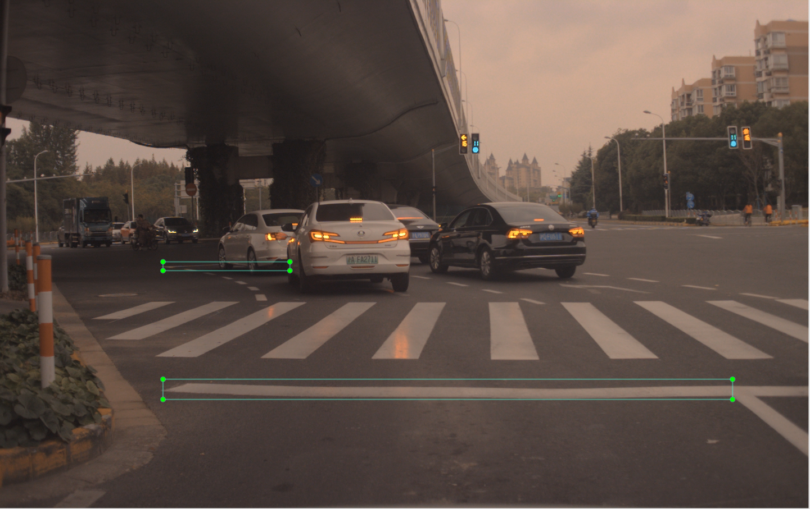

# **标注规则**  
所有情况仅标注本车行驶道上的停止线，行驶距离停止线约50~60米以内开始进行标注，以下图为极限距离基准。

  

__注：所有情况无论是否被遮挡，只要认为有停止线，都需进行标注。__  
## 一般情况（无遮挡）
左右边界：以本车车道为基准确定左右边界。  
上下边界：以停止线上下界为基准，允许一定的误差，不要有缺失，如示例图1，图2。
## 部分遮挡
左右边界：以本车车道为基准，确定左右边界，忽略遮挡部分。  
上下边界：以停止线上下界为基准，允许一定的误差，不要有缺失，如示例图3。  
## 全部遮挡
左右边界：以车道线为基准，借助旁边车道线确定左右边界，估算距离在本车行驶的车道线距离之内  
上下边界：通过旁边车道估算上下边界，估算距离尽量准确，如示例图4
## 示例
    

图1 一般情况，Bounding Box以停止线为基准  
    

图2 一般情况，车辆停在车道前，Bounding Box尽量包含所有的信息  
    

图3 部分遮挡，且距离车道线约50~60米，开始进行标注，根据左右车道预测Bounding Box位置  
    

图4 完全遮挡，根据左右车道及旁边车道停止线预测Bounding Box位置，估算上下边界距离，误差尽量减小  
    

图5 此种情况左边车道被遮挡大部分，应根据右侧车道预测停止线大致位置  
    

图6 此种情况车辆停止在前车之后等待信号灯，车道线被大部分遮挡应根据旁边车道位置预测停止线位置  
    

图7 此种情况视野大部分被车辆遮挡，信息基本完全缺失，不进行标注  
    

图8 此种情况包含常规停止线和左待停区停止线，需全部标注，切需将待停区停止线划分为新的标签（waiting stop line）  
