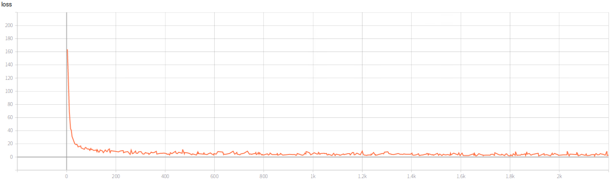
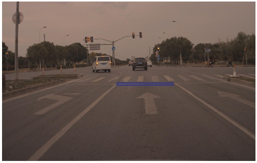
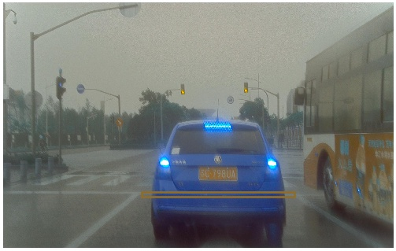
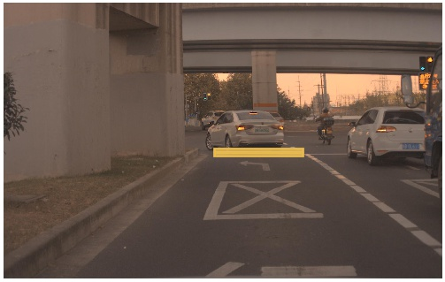
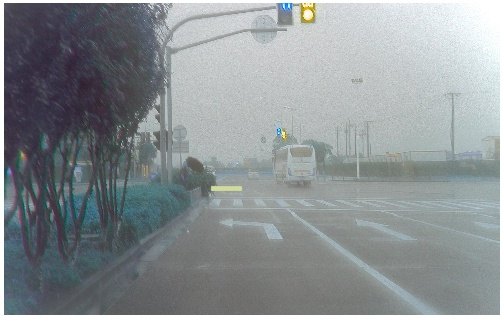
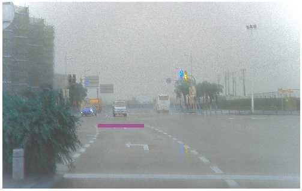
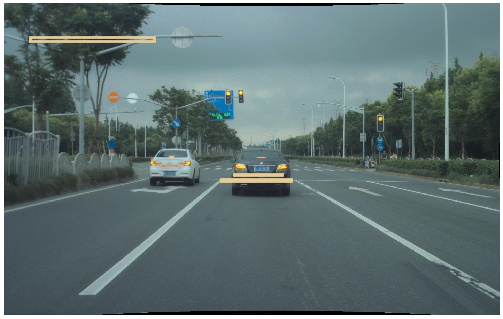
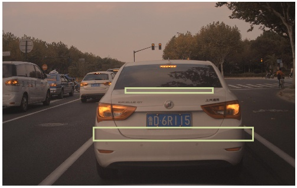
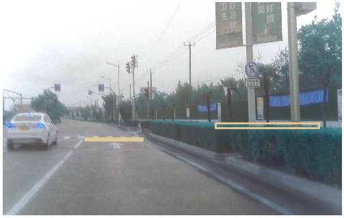

# **YOLOv3的Stopline检测**

## 数据集

数据集共1895个样本，其中，检测目标分成1类（Stopline），训练集1534张，验证集171张，测试集190张。

## 运行环境

实验平台Pytorch，使用Github上[YOLOv3](https://github.com/eriklindernoren/PyTorch-YOLOv3)的开源代码。

## 实验参数

YOLOv3网络参数采取默认配置（仅需修改检测类别），输入图像尺度416，batch_size=32，初始学习率0.001，优化器Adam，训练epoch=100；测试参数iou_thr=0.5，conf_thr=0.5，nms_thr=0.05。anchor_size=22,2, 38,2, 55,3, 74,4, 97,6, 127,8, 164,10, 210,13, 263,16

## 训练结果

Loss曲线：

测试集检测结果：

<table>
        <tr>
            <th>mAP</th>
            <th>Pre</th>
            <th>Rec</th>
            <th>F1</th>
            <th>Time</th>
            <th>Loss</th>
        </tr>
        <tr>
            <th>42.73%</th>
            <th>50.85%</th>
            <th>62.63%</th>
            <th>56.13%</th>
            <th>90ms</th>
            <th>0.902</th>
        </tr>
</table>

## 检测结果演示

## 存在问题
1）重复框

2）漏检

 

3）误检

